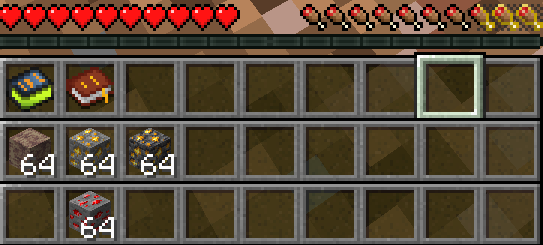
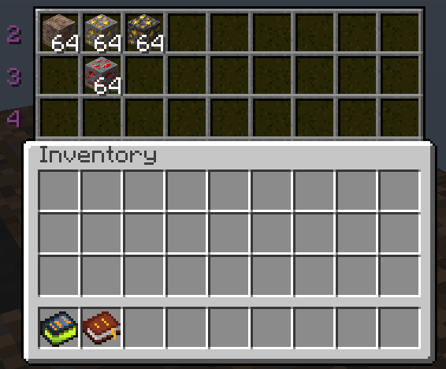

# Actual Multiple Hotbars

A Minecraft mod for adding Factorio-like hotbars with their own inventory to make working in modded minecraft less of a hassle.

## Features

A configurable amount of hotbars (up to 6) as a separate inventory.
One can have any amount of hotbars up to that configured amount displayed in the in-game HUD.

Various settings can be tweaked in the config, such as where items which are picked up are deposited.

Upon death all items in the separate inventory will also be dropped, unless the gamerule `keepinventory` is on.

## Hotkeys

* Pressing `CTRL + [1, 2, 3, etc]` will switch the current active hotbar to the selected alternative.
* Pressing `x` will rotate the hotbars.
* Pressing `NUMPAD *` will add another visible hotbar (up to the maximum available, then goes back to 1)

## Screenshots

